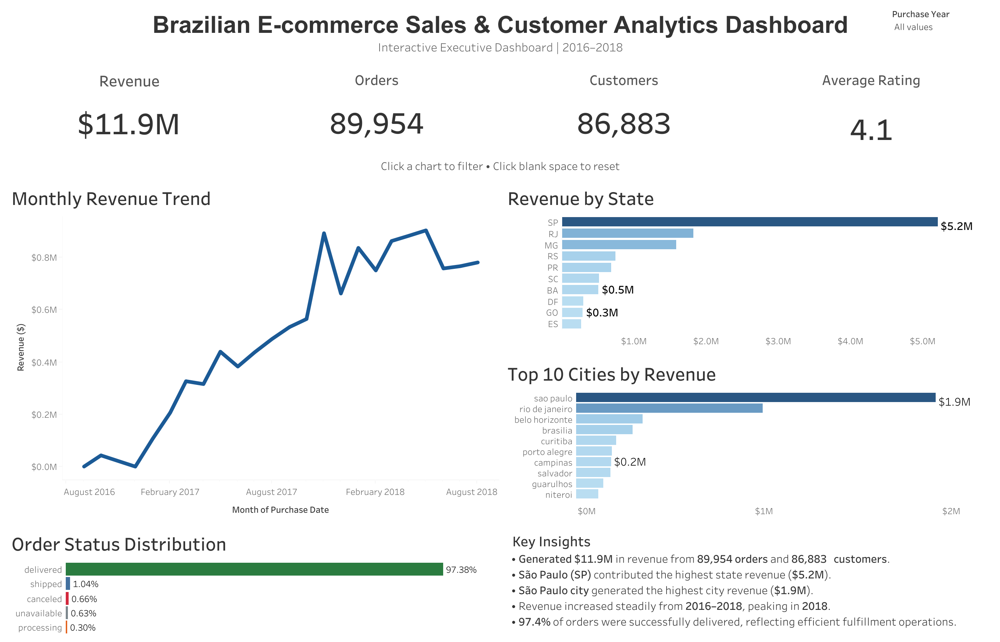

# Brazilian E-commerce Sales & Customer Analytics

An end-to-end Business Intelligence project analyzing Brazilian e-commerce transactions from 2016–2018 using PostgreSQL, SQL, Python, and Tableau. The project explores sales performance, customer activity, geographic trends, and order fulfillment through an interactive executive dashboard.

## 🔗 Live Dashboard

**Tableau Public:** [https://public.tableau.com/views/brazilian-ecommerce-sales-analytics](https://public.tableau.com/views/Brazilian_Ecommerce_Sales_Customer_Analytics_twbx/BrazilianE-commerceSalesCustomerAnalytics?:language=en-US&:sid=&:redirect=auth&:display_count=n&:origin=viz_share_link) 

---

## Project Overview

This project transforms raw Brazilian e-commerce data into business insights through data cleaning, SQL analysis, and interactive visualization.

The dashboard enables business users to monitor:

- Revenue performance
- Customer growth
- Order volume
- Geographic sales distribution
- Monthly revenue trends
- Order fulfillment performance

---

## Business Problem

An e-commerce company wants to understand:

- Which states and cities generate the most revenue?
- How has revenue changed over time?
- How many customers and orders contribute to sales?
- What is the order delivery success rate?
- Which regions drive overall business growth?

The goal is to build an executive dashboard that supports data-driven business decisions.

---

## Tech Stack

- PostgreSQL
- SQL
- Python
- Pandas
- Tableau
- Git
- GitHub

---

## Dataset

**Source:** Brazilian E-commerce Public Dataset

The project analyzes customer, order, payment, review, product, seller, and geographic information between **2016–2018**.

---

## Project Workflow

### 1. Data Cleaning

- Removed duplicate records
- Handled missing values
- Standardized data types
- Parsed purchase dates
- Validated relationships across tables

### 2. Database Design

Created relational tables in PostgreSQL and imported cleaned datasets.

### 3. SQL Analytics

Performed business analysis including:

- Revenue analysis
- Customer analysis
- State-wise revenue
- City-wise revenue
- Monthly revenue trends
- Order fulfillment distribution

### 4. Tableau Dashboard

Built an interactive executive dashboard featuring:

- KPI Cards
- Monthly Revenue Trend
- Revenue by State
- Top 10 Cities by Revenue
- Order Status Distribution
- Year Filter
- Cross-filter Dashboard Actions
- Executive Insights

---

## Dashboard Preview

[](tableau/dashboards/Brazilian_Ecommerce_Sales_Customer_Analytics.twbx)

---

## Dashboard KPIs

| Metric | Value |
|---------|-------:|
| Revenue | $11.9M |
| Orders | 89,954 |
| Customers | 86,883 |
| Average Rating | 4.1 |

---

## Key Insights

- Generated **$11.9M** in revenue from **89,954** orders and **86,883** customers.
- São Paulo (SP) contributed the highest state revenue (**$5.2M**).
- São Paulo city generated the highest city revenue (**$1.9M**).
- Revenue grew consistently from **2016 to 2018**, reaching its highest level in 2018.
- **97.4%** of orders were successfully delivered, indicating efficient fulfillment operations.

---

## Repository Structure

```
Brazilian-Ecommerce-Sales-Customer-Analytics/
│
├── data/
│   ├── raw/
│   └── processed/
│
├── database/
│   ├── schema.sql
│   ├── import_data.sql
│   └── analysis_queries.sql
│
├── notebooks/
│
├── scripts/
│
├── tableau/
│   └── Brazilian_Ecommerce_Sales_Customer_Analytics.twbx
│
├── screenshots/
│   └── executive_dashboard.png
│
├── README.md
└── requirements.txt
```

---

## Tableau Dashboard Features

- Interactive executive dashboard
- Dynamic year filtering
- Cross-filter dashboard actions
- Geographic performance analysis
- KPI monitoring
- Executive summary insights

---

## Future Improvements

- Customer segmentation (RFM Analysis)
- Customer lifetime value analysis
- Sales forecasting
- Cohort retention analysis
- Product category analysis
- Interactive map visualizations

---

## Author

**Aakanksha Bhondve**
